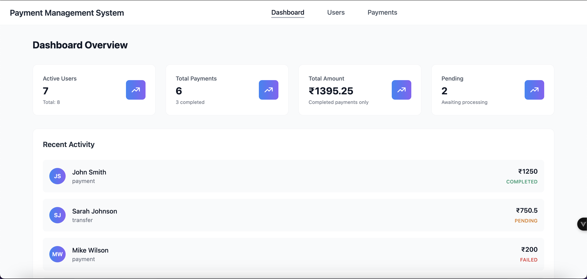
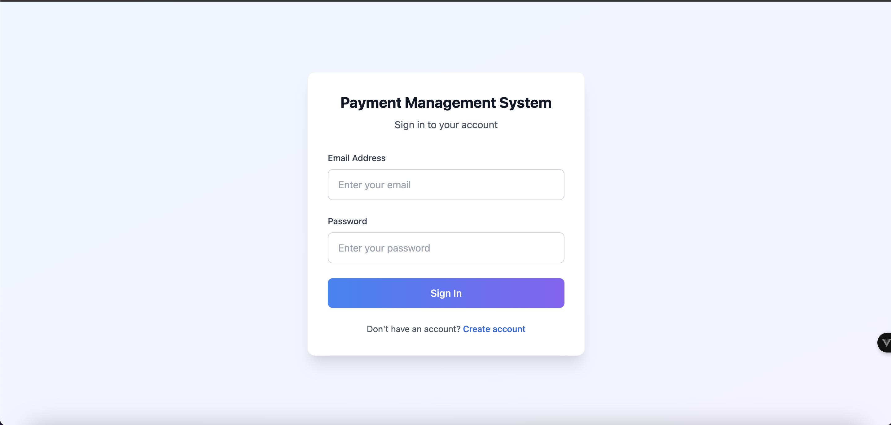
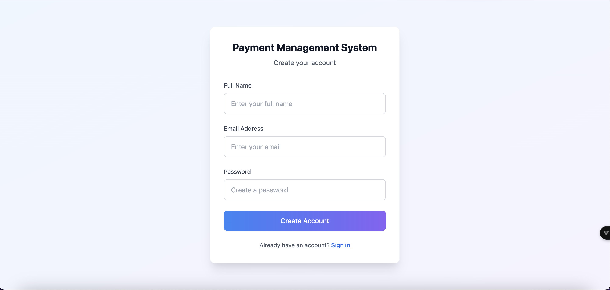
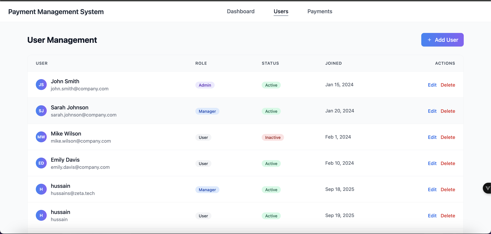
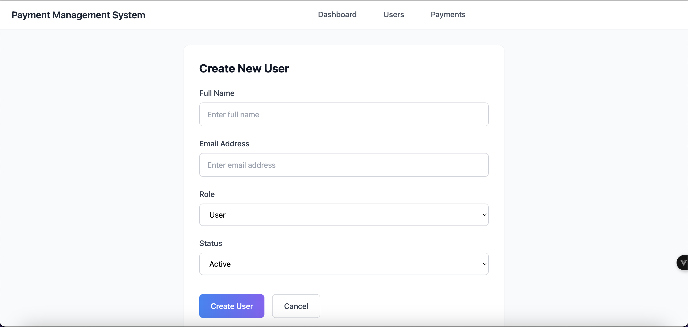
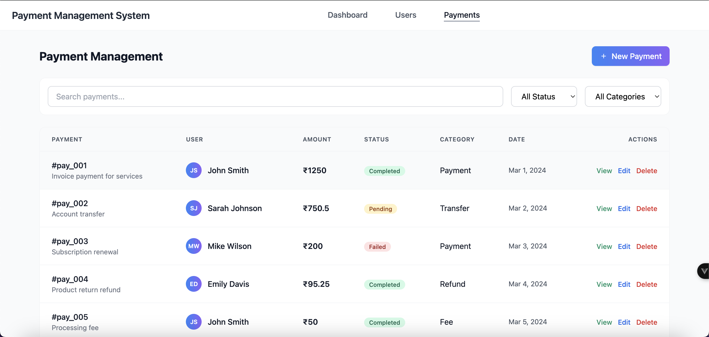

# 💳 Payment Management System

A modern, comprehensive web-based payment management system built with Vue 3, providing powerful tools for managing users, transactions, and financial operations in a business environment.



## 🌟 Features

- **User Management**: Complete user lifecycle with role-based access control
- **Payment Processing**: Comprehensive transaction handling with real-time status tracking  
- **Analytics Dashboard**: Real-time statistics and financial summaries
- **Advanced Search**: Multi-criteria filtering across payments and users

## 📱 Application Screenshots

### 🔐 Authentication
| Login | Registration |
|-------|--------------|
|  |  |

### 👥 User Management
| Users List | Add New User |
|------------|--------------|
|  |  |

### 💳 Payment Management


## 🚀 Installation

### Prerequisites
- Node.js (v16 or higher)
- npm or yarn package manager

### Setup Instructions

```bash
# Clone the repository
git clone https://github.com/hussain-2004/Payment-Management-System-Frontend-UI.git
cd Payment-Management-System-Frontend-UI

# Install dependencies
npm install

# Start development server
npm run dev

# Open browser at http://localhost:5173
```

### Available Scripts

```bash
# Development
npm run dev              # Start development server
npm run build           # Build for production
npm run preview         # Preview production build

# Testing
npm test               # Run unit tests
npm run test:watch     # Run tests in watch mode
npm run test:coverage  # Generate coverage report

# Code Quality
npm run lint           # Run ESLint
npm run lint:fix       # Fix ESLint issues
```

## 🏗️ Project Structure

```
src/
├── assets/           # Images and screenshots
├── components/       # Reusable components
│   ├── NavbarComponent.vue
│   ├── PaymentTableComponent.vue
│   ├── RecentPaymentComponent.vue
│   ├── StatusCardComponent.vue
│   └── UserTableComponent.vue
├── data/            # Sample data
├── router/          # Route configuration
├── store/           # Vuex store
├── test/            # Unit tests
├── views/           # Page components
│   ├── DashboardPage.vue
│   ├── LoginPage.vue
│   ├── PaymentDetailsInformation.vue
│   ├── PaymentInitiationForm.vue
│   ├── PaymentListSection.vue
│   ├── RegisterPage.vue
│   ├── UserFormPage.vue
│   └── UserListPage.vue
├── App.vue          # Root component
└── main.js          # Entry point
```
